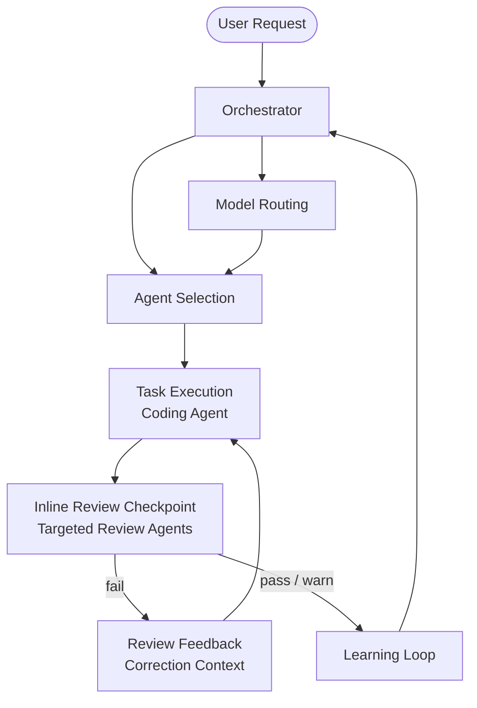

# Agentic Scrum Team

A persona-driven AI development team orchestrated through Claude Code's `.claude/` configuration system. Each scrum role is an autonomous agent with defined behavior, skills, and collaboration protocols.

## Quick Start

1. Copy `.claude/` into your project
2. Run `claude`
3. Describe what you need

```text
> Build a REST API for user authentication with JWT tokens
```

The Orchestrator analyzes the request, selects the right agents, and coordinates delivery. See [Setup](docs/setup.md) for full installation steps.

## How It Works

**Team agents** define roles (persona, behavior, collaboration). **Review agents** check the quality of work in real time. **Skills** define agent knowledge (patterns, guidelines, procedures). **Slash commands** define user-invocable workflows. The **Orchestrator** controls task routing, model selection, and the inline review feedback loop.



### Three-Phase Workflow

Every non-trivial task follows **Research → Plan → Implement** with human review gates between phases. During **Implement**, the orchestrator runs inline review checkpoints after each discrete unit of work using targeted review agents. Review findings feed back to the coding agent (max 2 correction cycles) before escalating to human.

## Documentation

| Guide | Description |
| --- | --- |
| [Setup](docs/setup.md) | Prerequisites and installation |
| [Usage](docs/usage.md) | Submitting requests, feedback keywords, intervention commands |
| [Agents](docs/agent_info.md) | Agent roster, persona template, adding/removing agents |
| [Skills & Commands](docs/skills.md) | Skills catalog, slash commands catalog, adding new skills and commands |
| [Architecture](docs/architecture.md) | Context management, quality assurance, governance, multi-LLM routing |

## Team Agents

| Agent | Purpose |
| --- | --- |
| **Orchestrator** | Routes tasks, selects models, coordinates inline review feedback loop |
| **Software Engineer** | Code generation, implementation, applies review corrections |
| **Data Scientist** | ML models, data analysis, statistical validation |
| **QA/SQA Engineer** | Testing, quality gates, peer validation |
| **UI/UX Designer** | Interface design, accessibility compliance |
| **Architect** | System design, tech decisions, scalability |
| **Product Manager** | Requirements, prioritization, stakeholder alignment |
| **Technical Writer** | Documentation, terminology consistency |

## Review Agents

13 specialized review agents run as sub-agents during Phase 3 checkpoints and full `/code-review` runs. Model selection is controlled by the orchestrator's routing table.

| Agent | Focus | Model |
| --- | --- | --- |
| `test-review` | Coverage gaps, assertion quality, test hygiene | sonnet |
| `security-review` | Injection, auth/authz, data exposure | opus |
| `domain-review` | Abstraction leaks, boundary violations | opus |
| `structure-review` | SRP, DRY, coupling, organization | sonnet |
| `complexity-review` | Function size, cyclomatic complexity, nesting | haiku |
| `naming-review` | Intent-revealing names, magic values | haiku |
| `js-fp-review` | Array mutations, impure patterns | sonnet |
| `concurrency-review` | Race conditions, async pitfalls | sonnet |
| `a11y-review` | WCAG 2.1 AA, ARIA, keyboard nav | sonnet |
| `performance-review` | Resource leaks, N+1 queries | haiku |
| `token-efficiency-review` | File size, LLM anti-patterns | haiku |
| `claude-setup-review` | CLAUDE.md completeness and accuracy | haiku |
| `svelte-review` | Svelte reactivity, closure state leaks | sonnet |

## Key Capabilities

| Capability | How It Works |
| --- | --- |
| **Orchestrator-controlled models** | Single routing table in `orchestrator.md` assigns models to all agents; frontmatter is a fallback |
| **Inline review loop** | After each unit of work, targeted review agents check output and feed corrections back to coding agents (max 2 iterations) |
| **Selective loading** | Only agents needed for the current task are loaded into context; review agents run as isolated sub-agents |
| **Context management** | Summarization triggers at 40% utilization to prevent hallucination |
| **Feedback keywords** | `amend`, `learn`, `remember`, `forget` update configuration in real time |
| **Human oversight** | Approval gates for high-impact decisions; `override`, `pause`, `stop` for intervention |
| **Quality validation** | Self-check → inline review → human gate |
| **Audit trail** | All decisions and changes logged to `metrics/` |
| **Eval system** | Review agents validated against fixtures in `.claude/evals/` via `/eval-runner` |

## File Structure

```text
.claude/
├── CLAUDE.md              # Orchestration pipeline + registries
├── agents/                # Team agents (10) + review agents (13)
├── skills/                # Reusable knowledge modules (17 skills)
├── commands/              # Slash commands / review workflows (9 commands)
├── hooks/                 # PostToolUse advisory hooks (3 active)
├── evals/                 # Review agent accuracy fixtures + transcripts
├── docs/                  # Eval system documentation
├── memory/                # Conversation summaries (runtime)
└── metrics/               # Performance logs (runtime)
```

## Slash Commands

| Command | What It Does |
| --- | --- |
| `/code-review` | Run all review agents with pre-flight gates |
| `/review-agent <name>` | Run a single review agent |
| `/eval-audit` | Audit agents and commands for structural compliance |
| `/eval-runner` | Run eval fixtures and grade review agent accuracy |
| `/add-agent` | Scaffold a new review agent |
| `/apply-fixes` | Apply correction prompts from `/code-review` |
| `/review-summary` | Generate compact session summary |
| `/semgrep-analyze` | Run Semgrep SAST |
