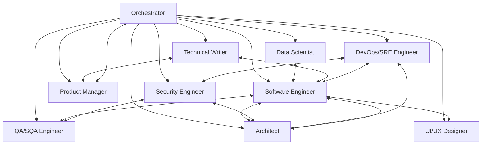

# Team Organization

```mermaid
graph TD
    CO[Orchestrator] --> SE[Software Engineer]
    CO --> DS[Data Scientist]
    CO --> AR[Architect]
    CO --> QA[QA/SQA Engineer]
    CO --> UX[UI/UX Designer]
    CO --> PM[Product Manager]
    CO --> TW[Technical Writer]
    CO --> SecE[Security Engineer]
    CO --> DO[DevOps/SRE Engineer]

    SE <--> QA
    SE <--> AR
    SE <--> UX
    DS <--> SE
    PM <--> CO
    AR <--> SE
    TW <--> PM
    TW <--> SE
    SecE <--> AR
    SecE <--> QA
    DO <--> AR
    DO <--> SE
    DO <--> SecE
```
